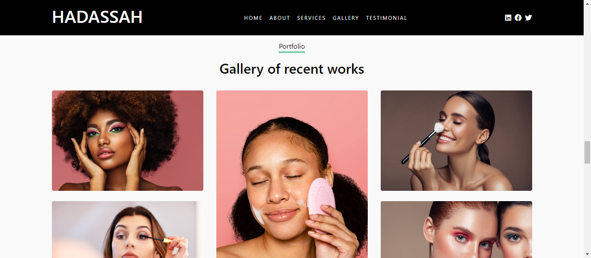

# Hadassah Makeup and Hairstyling App

Welcome to the Hadassah Makeup and Hairstyling App! This application showcases the makeup and hairstyling services offered by Hadassah, a skilled and experienced makeup artist.

## Demo
Check out the live demo [here](https://hadassah-makeup.vercel.app/).

## Table of Contents
- [About](#about)
- [Features](#features)
- [Getting Started](#getting-started)
- [Usage](#usage)
- [Screenshots](#screenshots)
- [Technologies Used](#technologies-used)
- [Contributing](#contributing)
- [License](#license)

## About
Hadassah Makeup and Hairstyling App is designed to provide information about Hadassah's makeup and hairstyling services. It includes sections such as an introduction, details about the makeup artist, booking information, and more.

## Features
- Introduction to Hadassah's makeup and hairstyling services.
- Booking modal for users to schedule appointments.
- Information about the makeup artist and her expertise.
- Responsive design for a seamless experience on various devices.

## Getting Started
1. Clone the repository: `git clone https://github.com/WisdomPandovic/Hadassah-Makeup.git`
2. Open the project in your preferred code editor.

## Usage
1. Open the `index.html` file in a web browser.
2. Explore different sections of the app.
3. Use the "Book Now" button to access the booking modal.

## Screenshots

## Technologies Used
- HTML
- CSS (Bootstrap)
- JavaScript (jQuery)

## Contributing
Contributions are welcome! Feel free to submit issues or pull requests.

## License
This project is licensed under the [MIT License](LICENSE).
